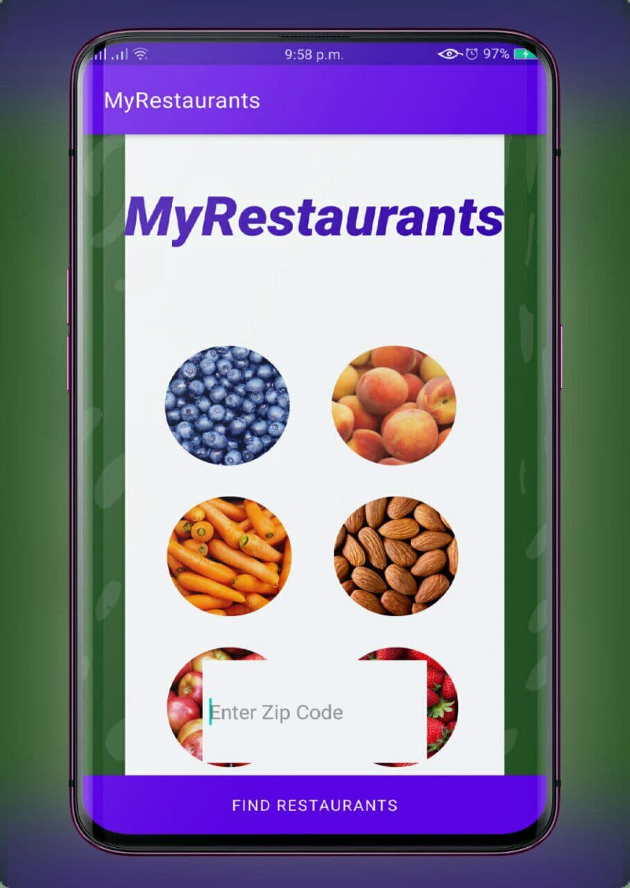

# MyRestaurants
#### September 2nd 2021
#### By **Stephen Njeri**



## Description

```bash

Meals are generally served and eaten on the premises, but many restaurants also offer take-out and food delivery services.

```
## Technologies Used

* Android studio
* Java
* Junit


## Installation

*git clone
* `git remote add origin https://github.com/Steve-njeri/MyRestaurants.git`
* `cd MyRestaurants`

## Launching the Application

```bash
1.Launch the project in Android Studio

```

